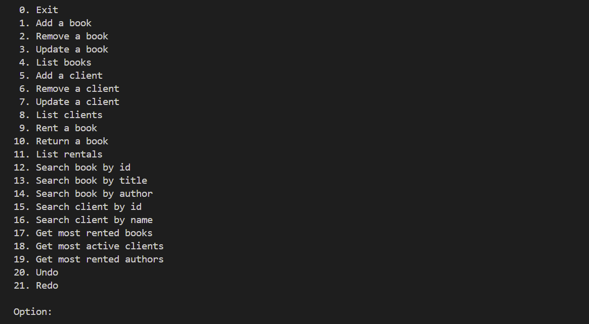

# Book Library

## Overview

This is a Python-based system designed to manage a library's books, clients, and rentals. It features functionalities such as adding, removing, updating, listing clients and books, renting and returning books, searching, generating statistics, and unlimited undo/redo operations.

## Features

- **Manage Clients and Books**: Add, remove, update, and list clients and books.
- **Rent and Return Books**: Handle the rental process of available books and their return.
- **Search Functionality**: Perform case-insensitive, partial string searches on clients or books.
- **Statistics Generation**: Generate statistics on the most rented books, most active clients, and most rented authors.
- **Undo/Redo Operations**: Unlimited undo/redo functionality with a memory-efficient implementation.
- **Persistent Storage**: Supports in-memory, text-file, and binary file repositories.

## Persistent Storage Configuration

The application utilizes file-based repositories for persistence. It can be configured to use either in-memory repositories, text-file repositories, or binary file repositories via the `settings.properties` file.

## Iterable Data Structure Module

The application includes a reusable Python module with an iterable data structure, a unique sorting algorithm, and a filter method. This module is accompanied by comprehensive PyUnit tests ensuring 100% coverage.

## Getting Started

### Prerequisites

- Python 3.11

### Installation

1. Clone the repository.

2. Configure the application using the `settings.properties` file.

## Usage

1. Run the `main.py` file having `src` as the working directory.

2. Follow the on-screen prompts to manage the library.

## Preview

## License

This project is licensed under the GNU General Public License v3.0 - see the [LICENSE](./LICENSE) file for details.
